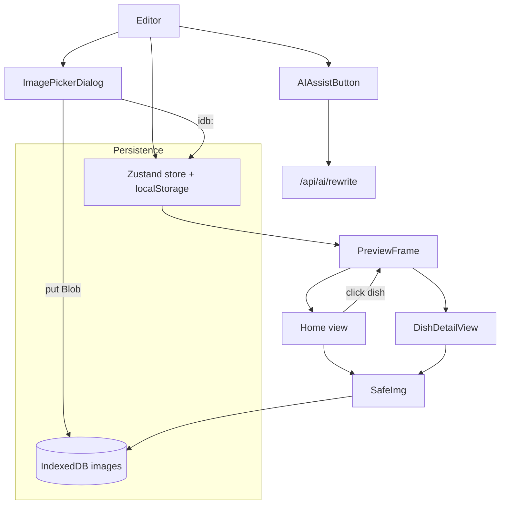

# Major UX upgrades batch

## Decisions confirmed

- Local image uploads live in **IndexedDB as Blobs**. Schema strings reference them via an `idb:<id>` pseudo-URL so all existing image fields keep working.
- Dish detail uses **preview-internal navigation** (mini-router in the preview pane). Editor stays visible on the left.
- Image picker is a single reusable **modal with Upload / From URL / Stock tabs** plus a "Recent" strip.
- AI assistance is a **magic-wand popover** next to the highest-value text fields (tagline, story, item name, item description, chef, section name).
- Theme system splits into **layout preset** (the existing 3) and **color config** (mode + 4 custom color slots) - light/dark is a config field, not a separate theme.

## Architecture



## Schema changes ([lib/schema.ts](lib/schema.ts))

```ts
const MenuItem = z.object({
  // existing: id, name, description, price, tags
  imageUrl: z.string().default(""),        // primary dish image
  gallery: z.array(z.string()).default([]),// extra images for detail page
  chef: z.string().default(""),            // optional chef byline
});

const ThemeColors = z.object({
  primary: z.string().optional(),      // accent
  secondary: z.string().optional(),
  background: z.string().optional(),
  foreground: z.string().optional(),   // text
});
const ThemeConfig = z.object({
  preset: z.enum(["modernBistro","cozyCafe","sunnyCoastal"]),
  mode: z.enum(["light","dark"]).default("light"),
  colors: ThemeColors.default({}),
});

// Replace existing `theme: ThemeEnum` on RestaurantData with `theme: ThemeConfig`.
// Migration: in the store's `migrate`, coerce the old string theme into { preset, mode: defaultModeFor(preset), colors: {} }.

const RestaurantData = z.object({
  // ...existing fields
  recentImageUrls: z.array(z.string()).max(20).default([]),
});
```

## 1. IndexedDB image store

- New [lib/imageStore.ts](lib/imageStore.ts) - tiny wrapper, no external dep:
  ```ts
  export async function putImage(blob: Blob): Promise<string>      // returns "idb:<uuid>"
  export async function getImageBlob(id: string): Promise<Blob | null>
  export async function deleteImage(id: string): Promise<void>
  export async function listIds(): Promise<string[]>
  ```
  Uses one DB (`restaurant-builder-images`), one object store (`images`).
- New [lib/useResolvedImage.ts](lib/useResolvedImage.ts) hook:
  - If `src` starts with `idb:`, fetch blob -> `URL.createObjectURL` -> revoke on cleanup.
  - Otherwise, pass `src` through unchanged.
  - Returns `{ url, loading, error }`.
- Update [components/preview/SafeImg.tsx](components/preview/SafeImg.tsx) to use `useResolvedImage` so every image render site automatically handles the `idb:` scheme (themes, dish detail, hero, etc.).

## 2. Reusable ImagePickerDialog ([components/editor/ImagePickerDialog.tsx](components/editor/ImagePickerDialog.tsx))

Three tabs (driven by props - hero shows all three, dish shows only Upload + URL):

- **Upload**: a dropzone (native drag-and-drop on a `<div>` + hidden `<input type="file" accept="image/*">`). Shows file preview thumbnail, validates type and size (<= 5 MB), calls `putImage(blob)`, returns the resulting `idb:<id>`.
- **From URL**: text input with a "Preview" image, validates that it loads, on confirm returns the URL and pushes it to `recentImageUrls`.
- **Stock**: only shown for hero; renders the existing 6 Unsplash thumbnails plus any recent URLs.

Returns the chosen `src` string via an `onSelect` callback. Dialog stays open until user confirms or closes (no auto-close on grid click).

## 3. Hero image overhaul ([components/editor/HeroEditor.tsx](components/editor/HeroEditor.tsx))

- Replace the inline "Use stock photo" toggle with a single "Change image" button that opens `ImagePickerDialog`.
- Stock grid inside the dialog stays open after selecting (no implicit close) - user can preview side-by-side and keep picking until they hit "Done".
- "Recent" strip inside the dialog shows the last 6 of `recentImageUrls`.

## 4. Dish image in menu (editor + preview)

### Editor ([components/editor/MenuEditor.tsx](components/editor/MenuEditor.tsx))
Expanded item view gains three rows:
- Primary image (single picker, opens `ImagePickerDialog`).
- Chef byline (text input).
- Gallery (multi-image picker - same dialog reused, one image at a time, max 6).

### Preview (all three themes in [components/preview/themes/](components/preview/themes/))

Each menu item now renders with its `imageUrl` (a small left thumbnail or top card image depending on theme).

Add a `MenuList` helper component used by all three themes:

```tsx
<div className="flex flex-col gap-4 md:gap-5
                max-md:flex-row max-md:overflow-x-auto max-md:snap-x
                max-md:snap-mandatory max-md:scroll-pl-4 max-md:pl-4 max-md:pr-4
                max-md:scrollbar-thin">
  {items.map(item => (
    <DishCard key={item.id} item={item}
              className="max-md:min-w-[85%] max-md:snap-start" />
  ))}
</div>
```

- Desktop: vertical list (current look).
- Mobile (`< md`): horizontal scroll-snap carousel, one card visible at a time, native swipe gesture, no JS. CSS-only, performant.

## 5. Dish detail "page" (preview-internal)

- New view state inside [components/preview/PreviewFrame.tsx](components/preview/PreviewFrame.tsx):
  ```ts
  type View = { kind: "home" } | { kind: "dish"; id: string };
  const [view, setView] = useState<View>({ kind: "home" });
  ```
- Pass `view` and `onNavigate` down to the active theme component.
- Home theme renders `DishCard` as a `<button onClick={() => onNavigate({ kind: "dish", id: item.id })}>`.
- New shared [components/preview/DishDetailView.tsx](components/preview/DishDetailView.tsx):
  - Receives the dish, the resolved theme palette (CSS vars from preview root), and `onBack`.
  - Layout: back button -> hero image + gallery slider (simple horizontal-snap or a small slide-index state) -> name -> price + tags -> chef byline -> description.
  - Uses the same `--t-bg`, `--t-fg`, `--t-accent` variables - looks native to whichever theme is active.
- "View as visitor" fullscreen still works: it fullscreens `PreviewFrame`, which internally renders `view`. Clicking a dish in fullscreen drills in; back button returns to home. Real browser back is not wired (out of scope - it would need real routes).
- If `view.kind === "dish"` and the dish gets deleted in the editor, fall back to `{ kind: "home" }`.

## 6. AI text assistance

### New endpoint ([app/api/ai/rewrite/route.ts](app/api/ai/rewrite/route.ts))

```ts
POST /api/ai/rewrite
body: {
  fieldKind: "tagline"|"story"|"dish_name"|"dish_description"|"chef"|"section_name",
  current: string,             // can be empty (= generate from scratch)
  action: "improve"|"shorten"|"more_descriptive"|"generate",
  context: { restaurantName, cuisine, vibe, dishName? }
}
returns: { value: string }
```

System prompt instructs concise output matching the field kind and length norms (tagline <= 80 chars, dish_description 8-15 words, story 3-5 sentences, etc.). Uses `gpt-4o-mini`, plain JSON response, Zod-validated.

### Client ([components/editor/AIAssistButton.tsx](components/editor/AIAssistButton.tsx))

Small wand-icon button. On click, opens a popover with 4 actions (Improve, Shorten, More descriptive, Generate). Action -> POST -> set field value -> toast. Soft-disabled when `!aiEnabled`.

Wired into: tagline input, story textarea, section name (small), dish name input, dish description, chef input. Not wired into: contact details, prices, URLs, hours.

## 7. Theme system overhaul

### Schema
`RestaurantData.theme` becomes `{ preset, mode, colors }` (see Schema changes above). Migration in [lib/store.ts](lib/store.ts)'s `migrate` coerces the old string form.

### Palettes
- Each preset exports two palettes: `lightDefaults` and `darkDefaults`, each defining the 6 CSS vars (`--t-bg`, `--t-fg`, `--t-muted`, `--t-accent`, `--t-card`, `--t-border`).
- New helper `resolveThemeVars(theme: ThemeConfig)` returns the final CSS-var map: start from `<preset>.<mode>Defaults`, then apply any custom colors as overrides:
  - `colors.primary` -> `--t-accent`
  - `colors.background` -> `--t-bg`
  - `colors.foreground` -> `--t-fg`
  - `colors.secondary` -> `--t-card` (or similar - documented in the helper).

### Themes
- Remove the hardcoded `.theme-modernBistro`/`.theme-cozyCafe`/`.theme-sunnyCoastal` blocks from [app/globals.css](app/globals.css).
- The preview root applies vars inline:
  ```tsx
  <div style={resolveThemeVars(data.theme)} className="bg-[var(--t-bg)] text-[var(--t-fg)]">
  ```
- Layout/typography differences between presets stay in the theme components (e.g. ModernBistro's centered hero vs CozyCafe's side-by-side hero).

### Editor ([components/editor/ThemePicker.tsx](components/editor/ThemePicker.tsx))

Three subsections:
1. **Layout preset**: existing 3 cards.
2. **Mode**: Light / Dark button group (defaults sensibly per preset: bistro=dark, cafe=light, coastal=light).
3. **Customize colors** (collapsible, closed by default): 4 native `<input type="color">` fields for Primary, Secondary, Background, Text, plus a "Reset to defaults" button. Updates `data.theme.colors`.

## Edge cases handled

- IndexedDB unavailable (Safari private mode etc.) - `putImage` throws, dialog shows a clear "Your browser blocked local storage of images" message, falls back to URL tab.
- `idb:` ID points to a missing blob (data partially cleared) - `useResolvedImage` returns error, SafeImg shows the fallback placeholder.
- Object URL leak on unmount - `useResolvedImage` cleans up via `URL.revokeObjectURL`.
- Recent URLs deduped, capped at 20.
- Large uploads (> 5 MB) rejected client-side with a toast.
- Custom color values invalid (`""`, malformed) - skipped by `resolveThemeVars`, defaults win.
- Dish detail navigated to a deleted dish - effect detects and resets view to `home`.
- Mobile carousel: each card has a `tabindex` for keyboard, focused card scrolls into view via `scroll-snap`.
- AI rewrite: missing key, timeout, invalid JSON each toast distinctly; field never gets clobbered with an error message.
- Schema migration on existing localStorage from the previous shape (string theme + items without imageUrl/gallery/chef) - all handled by Zod defaults plus the explicit `migrate` coercion of `theme`.

## Modern patterns used

- Native HTML `<input type="color">` - zero dep, accessible, works on every modern browser.
- Native `<input type="file">` + drag-and-drop on a styled `<div>` - no `react-dropzone` dep.
- CSS scroll snap for the mobile carousel (`snap-x snap-mandatory` + `snap-start`) - no JS carousel needed, gets native momentum on iOS.
- IndexedDB via the raw API behind a 60-line wrapper - no `idb`/`dexie` dep.
- Popover via the existing `Dialog` primitive in a compact "anchored" form, OR a small custom positioned div - decision deferred to implementation.
- Zod migration for safe schema evolution.
- Object-URL lifecycle managed in a React hook so leaks are impossible.

## Out of scope (explicit non-goals)

- Real Next.js routes for dishes (no `/dish/[id]`).
- Image cropping or compression - we just accept the raw file (capped at 5 MB).
- Per-section theme overrides.
- Sharing/exporting custom themes.
- Real browser back/forward integration with the preview's mini-router.

## Verification

- `npm run build` clean.
- Manual flow:
  1. Hero: open picker, switch between Upload / URL / Stock, drop a local image, see it render. Pick a stock image, the dialog stays open; click another, swap. Paste a URL, it shows up in Recent next time.
  2. Menu: expand a dish, add a local image, chef, gallery; on mobile-width preview, swipe horizontally through dishes in a section.
  3. Click a dish in the preview - dish detail view opens; gallery slider works; back button returns home; "View as visitor" fullscreens whichever view is showing.
  4. Click the wand next to "Tagline" with `OPENAI_API_KEY` set; choose "Improve"; field updates with a better tagline.
  5. Theme: pick "Cozy Cafe", toggle to Dark, expand Customize, change primary to bright pink, see preview update instantly; click Reset, defaults return.
  6. Refresh the page: theme, dishes, local images, recent URLs all persist.
