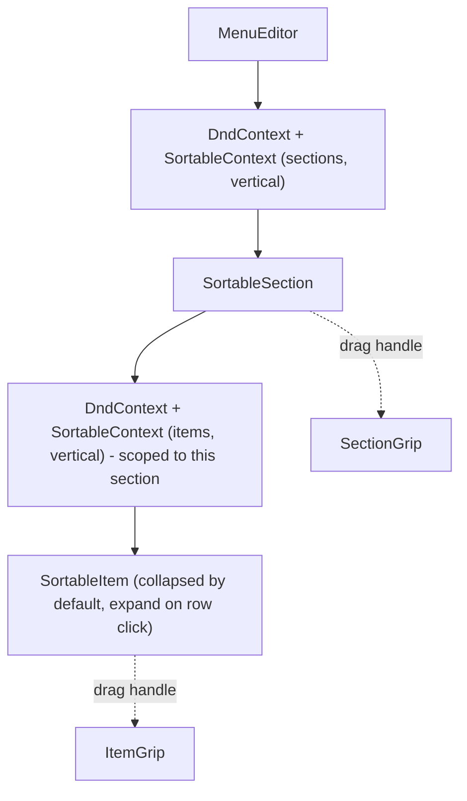

# Menu drag-and-drop + collapsible items

## Decisions

- Library: **@dnd-kit** (`@dnd-kit/core`, `@dnd-kit/sortable`, `@dnd-kit/utilities`). It is the modern React DnD standard - accessible by default (keyboard arrows + screen-reader announcements), touch-friendly, ~10 KB gzipped, and actively maintained (`react-beautiful-dnd` is abandoned).
- Scope: **within-section reordering only**. Sections reorder among themselves; items reorder among their siblings inside the same section. Cross-section drag is out of scope per user choice.
- Expand affordance: **click anywhere on the item row** (not a separate edit/pencil button). This is the dominant modern pattern (Notion, Linear, Airtable, Figma). A `ChevronRight` icon rotates on expand to give a clear visual hint. A dedicated grip handle on the left is the only thing that initiates drag; clicks on the grip and trash button do not toggle expand.

## Architecture



Two independent `DndContext`s - one at the section level, one per section for that section's items - keeps state isolated and avoids cross-section drop confusion.

## File changes

### 1. [package.json](package.json) - add three deps
- `@dnd-kit/core`
- `@dnd-kit/sortable`
- `@dnd-kit/utilities`

Install with the latest stable versions.

### 2. [lib/store.ts](lib/store.ts) - two new reorder actions

Add to the `StoreState` interface and implementation:

```ts
reorderMenuSections: (fromIndex: number, toIndex: number) => void;
reorderMenuItems: (sectionId: string, fromIndex: number, toIndex: number) => void;
```

Implementation uses `arrayMove` from `@dnd-kit/sortable` (immutable array reorder) and patches `data.menu` accordingly. This keeps the reorder logic in the store, the same place `addMenuItem` / `removeMenuItem` live.

### 3. [components/editor/MenuEditor.tsx](components/editor/MenuEditor.tsx) - rewrite

Restructure into three components in the same file:

- `MenuEditor` - top-level, owns the sections `DndContext` and renders `<SortableSection>` for each section. `onDragEnd` calls `reorderMenuSections`.
- `SortableSection` - wraps a section. Uses `useSortable({ id: section.id })`. Drag handle is the `GripVertical` icon (only the icon gets `{...listeners} {...attributes}`). Owns its own `DndContext` for its items list and renders `<SortableItem>`s.
- `SortableItem` - wraps a menu item. Uses `useSortable({ id: item.id })`. Local `expanded` state (`useState(false)`).

#### Collapsed item row (default)

Single horizontal row, click toggles expand:

```
[Grip] [Chevron] Item name . Tag . Tag           Price   [Trash]
```

- Grip: drag handle only, `onClick={e => e.stopPropagation()}`
- Chevron: rotates 90 deg when expanded (CSS transform)
- Name shown as plain text when collapsed; if empty, placeholder text "Untitled item"
- Tags shown as small badges (read-only summary)
- Price shown as muted text on the right
- Trash: `onClick={e => { e.stopPropagation(); removeItem(...); }}`
- The row itself is a `<button type="button">` with `aria-expanded={expanded}` for a11y

#### Expanded item row

Same top row, plus a content area below with the existing edit affordances (name input, price input, description textarea, dietary tag toggles). The full edit UI from the current [`MenuEditor`](components/editor/MenuEditor.tsx) moves into this expanded block.

#### Drag visuals

- Apply `transform` + `transition` from `@dnd-kit/utilities`'s `CSS.Transform.toString(transform)` to the wrapper.
- While dragging (`isDragging`), bump `z-index`, add a subtle shadow and 0.6 opacity so the row visibly "lifts."
- Cursor on the grip: `cursor-grab`, `cursor-grabbing` while active.

#### A11y wins (free from @dnd-kit)

- Keyboard reorder: focus the grip, press space, arrow up/down, space to drop.
- Screen reader announcements for pickup/move/drop are automatic.
- `aria-expanded` on the collapsible row.

### 4. Sensors

Use a `PointerSensor` (with `activationConstraint: { distance: 6 }` so a click on the row that ends in a tiny movement does not get interpreted as a drag) and a `KeyboardSensor` (defaults are good).

## Edge cases handled

- Single item or single section in a list - DnD still mounts cleanly, no reordering possible but no errors.
- Cancel drag (Escape) - @dnd-kit restores original order; nothing extra to do.
- Drop on self (no movement) - `onDragEnd` short-circuits when `active.id === over.id`.
- Click-then-drag-on-grip - `activationConstraint.distance` prevents accidental drag on a click.
- Click on input/textarea inside expanded row - `stopPropagation` on the expandable container's `onClick` only triggers for the top header strip, not the expanded body, so editing inputs does not collapse the row.
- Touch devices - PointerSensor handles touch out of the box.

## What stays the same

- `components/editor/MenuEditor.tsx` keeps its empty state ("Add your first section") and its bottom `Add section` button.
- The data shape ([`lib/schema.ts`](lib/schema.ts)) does not change - order is implicit in array position.
- No changes needed in the preview themes; they already render whatever order `data.menu` has.
- Persistence is automatic - the Zustand store's `persist` middleware writes the reordered `data.menu` to localStorage on every change.

## Verification

- `npm run build` clean.
- Manual: drag a section by its grip, drag an item by its grip, refresh page and confirm order persists, expand/collapse items by clicking the row, confirm trash and grip do not toggle expand, confirm keyboard reorder works (Tab to grip, Space, Arrow Down, Space).
