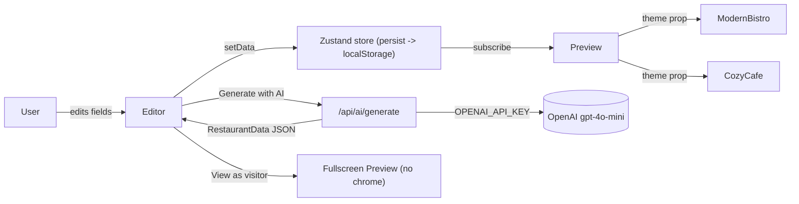

# Restaurant Website Builder - MVP Plan

## 1. Product framing

Position: **"Fastest path from idea to a credible restaurant site."** Not a blank-canvas Wix clone.

Core flow:
1. Land on app -> see a believable sample restaurant pre-loaded.
2. Hit "Generate with AI" or edit fields directly.
3. Watch the preview update live.
4. Click "View as visitor" -> fullscreen, no editor chrome. That IS the published site.

No auth. No DB. No custom domains. No payments. Persistence is single-browser via localStorage.

## 2. Tech stack

- Next.js 15 (App Router) + TypeScript - one container, server route for AI key safety
- Tailwind CSS + a minimal shadcn/ui subset (Button, Input, Textarea, Tabs, Dialog, Sonner)
- Zustand with `persist` middleware - one-liner localStorage sync
- React Hook Form + Zod - single source of truth for shape and validation
- `openai` SDK (`gpt-4o-mini`) called only from `/api/ai/*` route handlers
- lucide-react icons
- `sonner` for toasts
- No image upload pipeline - URL paste + a built-in stock-photo picker (6-8 Unsplash URLs)

## 3. Data model (single source of truth)

One Zod schema in `lib/schema.ts` consumed by editor, preview, AI parsing, and Zustand:

```ts
const MenuItem = z.object({ id, name, description, price, tags: z.array(enum: ["V","GF","DF","Spicy"]) });
const MenuSection = z.object({ id, name, items: z.array(MenuItem) });
const Hours = z.object({ day: enum, open: string, close: string, closed: boolean });
const Theme = z.enum(["modernBistro", "cozyCafe"]);

const RestaurantData = z.object({
  name, tagline, story,
  cuisine, priceLevel: enum(["$","$$","$$$","$$$$"]),
  heroImageUrl, gallery: z.array(string).max(6),
  menu: z.array(MenuSection),
  hours: z.array(Hours),
  contact: { phone, email, address, mapsUrl, instagram },
  theme: Theme,
});
```

Store version field (`schemaVersion: 1`) so a mid-build shape change does not nuke localStorage on reload - `try/catch` parse and fall back to sample data.

## 4. App structure

```
app/
  layout.tsx              root, Sonner mount, theme CSS vars
  page.tsx                editor shell (client)
  api/ai/generate/route.ts  POST: cuisine+vibe -> draft RestaurantData (streaming optional)
  api/ai/rewrite/route.ts   POST: field + tone -> rewritten text
components/
  editor/
    EditorShell.tsx       split-pane layout, "View as visitor" toggle
    HeroEditor.tsx
    AboutEditor.tsx
    MenuEditor.tsx        add/remove sections + items
    HoursEditor.tsx
    ContactEditor.tsx
    ThemePicker.tsx
    AIOnboardingDialog.tsx
  preview/
    SitePreview.tsx       picks theme component, renders RestaurantData
    themes/ModernBistro.tsx
    themes/CozyCafe.tsx
    PreviewFrame.tsx      wraps preview, mobile/desktop toggle
lib/
  schema.ts               Zod + z.infer types
  store.ts                Zustand + persist (key: "restaurant-builder:v1")
  ai.ts                   prompt templates + OpenAI client (server-only)
  sample.ts               SAMPLE_RESTAURANT used on first load
```

## 5. Architecture diagram



## 6. Time budget (2 hours, hard cap)

- 0:00-0:10 - Scaffold, push first commit, verify Railway-style boot
- 0:10-0:25 - Zod schema, Zustand store + persist, sample data, base layout
- 0:25-0:55 - Section editors wired to store (Hero, About, Menu, Hours, Contact, Theme)
- 0:55-1:20 - Two themes (`ModernBistro`, `CozyCafe`) + `SitePreview` + mobile/desktop toggle
- 1:20-1:40 - AI onboarding dialog: cuisine + vibe + city -> full `RestaurantData` (validated through Zod before commit)
- 1:40-1:55 - Polish pass: empty states, loading, responsive editor, copy review, "View as visitor" fullscreen, OG meta on root
- 1:55-2:00 - `instructions.md` + final commit

**Cut order if behind at 1:00:** drop `/api/ai/rewrite`; if still behind at 1:30, drop AI dialog entirely and ship the builder + themes - they alone clear the "polished MVP" bar.

## 7. Key implementation notes

- **AI route returns strict JSON.** Use `response_format: { type: "json_object" }` + a system prompt with the exact schema. Parse with Zod before writing to the store; on parse fail, toast "AI returned an unexpected shape, please try again" and keep the existing draft.
- **Server-only key.** `OPENAI_API_KEY` is read inside the route handler; never imported in a client component.
- **Soft-disable AI.** On the client, expose `/api/ai/health` (or just have buttons check a `NEXT_PUBLIC_AI_ENABLED` flag computed at build/runtime) so the UI grays out AI buttons when no key is configured. Builder still fully usable.
- **Themes share a prop contract** (`{ data: RestaurantData }`). Theme swap = one Zustand field change.
- **CSS variables per theme** on the preview root (`--bg`, `--fg`, `--accent`, `--font-display`) so visual differentiation is dramatic, not subtle.
- **`<PreviewFrame>` toggle** between `max-w-sm` (mobile) and full width, plus a "View as visitor" button that pushes the preview to `fixed inset-0 z-50` and hides editor chrome - this is "publish" without routing.
- **First-load behavior**: if `localStorage` is empty, hydrate with `SAMPLE_RESTAURANT` (Pizzeria Lina) so the preview is never blank.

## 8. Edge cases to handle

- Empty state -> sample data; never show a blank preview.
- Image URL 404 -> `` fallback to a neutral placeholder div.
- Long names/descriptions -> Tailwind `line-clamp-*`, no horizontal overflow.
- Hours: support per-day `closed: true` and graceful `--` rendering.
- Price formatting tolerant of `"$12"`, `"12"`, `"12.50"`, `"Market"` - render as-is, don't coerce.
- Menu with zero sections -> editor shows a clear "Add your first section" CTA; preview hides the menu block.
- AI: missing key, 429, 500, timeout (>15s), invalid JSON - each shows a distinct toast; editor never blocks.
- localStorage parse failure (schema mismatch) -> reset to sample, toast "Your saved data was from an older version".
- XSS: rely on React's default escaping; do not use `dangerouslySetInnerHTML` anywhere.
- Mobile editor usable down to 375px width (reviewers will check on a phone).
- Reload: `persist` rehydrates; show a small "Saved" badge to build trust.
- Railway port: `next start -p $PORT` in the start script.

## 9. Modern patterns checklist

- Server Components by default; client components only where interactive (editor pane, preview pane).
- Zod schema -> `z.infer` types; same schema validates AI output.
- Streaming AI responses if time allows (`Response` with `ReadableStream`); progressive UX.
- Optimistic UI: store update is synchronous, preview re-renders instantly.
- Suspense + skeletons around AI dialog content.
- Error boundary around `<SitePreview>` so a bad theme cannot crash the editor.
- A11y: semantic `<header>`, `<main>`, `<section>`, labels on all inputs, visible focus rings.
- `next/image` with `remotePatterns: ["images.unsplash.com"]` for hero/gallery.
- `generateMetadata` on root with restaurant name + tagline -> nice Slack/iMessage previews.
- Toast feedback on save/AI success/AI fail.

## 10. `instructions.md` contents (kept under 20 lines)

- Build & run: `npm ci && npm run build && npm start`
- Required env: `OPENAI_API_KEY` (optional - AI features soft-disable without it)
- Port: respects `$PORT` (Railway-friendly)
- Persistence: localStorage in the reviewer's browser; redeploys do not affect saved data
- Try-this: "Click *Generate with AI*, type 'tapas bar in Lisbon, romantic', then toggle *View as visitor*."

## 11. Top risks and pre-mitigations

- Deploy fails late -> push a hello-world to Railway at 0:10 and confirm boot before adding features.
- Themes look the same -> enforce divergence: serif + warm palette vs sans + monochrome; different layouts (centered hero vs side-by-side).
- AI returns garbage JSON -> strict `response_format` + Zod gate + a "Try again" button.
- Scope creep on image upload -> URL paste only, plus 6 curated Unsplash stock URLs in a picker.
- Last-15-minutes polish skipped -> reserved in the time budget as a non-negotiable block.

## 12. Success criteria checklist (self-grading before submit)

- [ ] Reviewer reaches a credible-looking site within 60 seconds of opening the app
- [ ] AI onboarding produces a fully-populated, on-brand draft
- [ ] Two themes that look genuinely different
- [ ] Mobile preview looks good at 375px
- [ ] Reload preserves work
- [ ] No console errors on first load
- [ ] `instructions.md` is short and accurate
- [ ] Final commit is before the 2-hour mark
